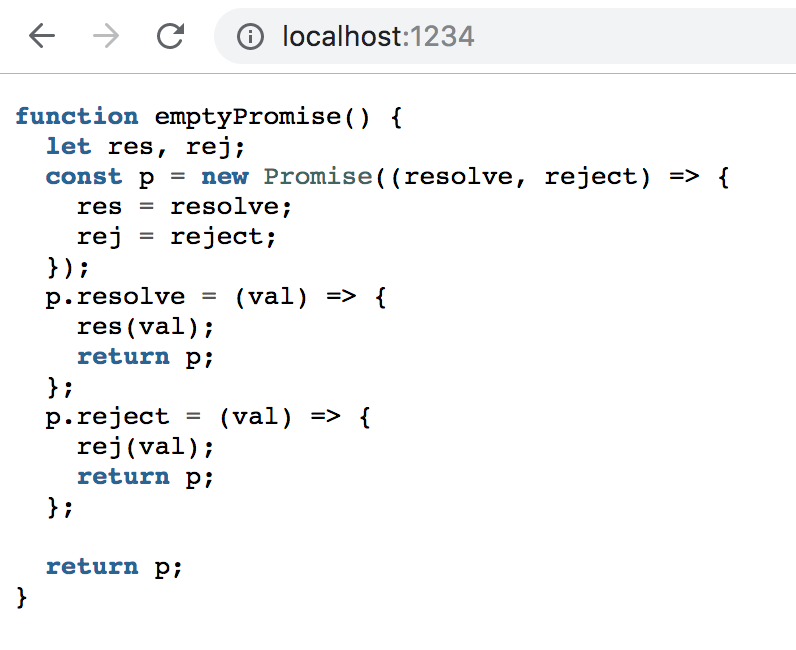
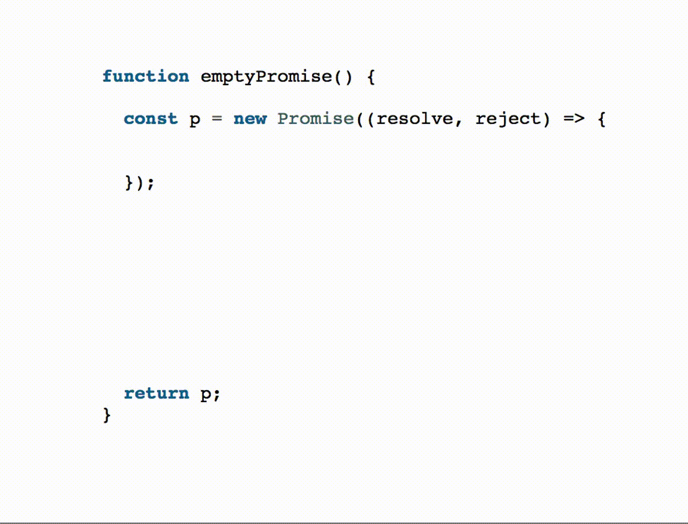

Progressively Uncover Code
==========================

When you're giving a presentation, it's best to avoid showing a pageful of code. Sometimes, though, it's unavoidable. In those situations, you can still guide your audience's understanding by progressively uncovering the code snippet. This topic came up on the DenverDevs slack, and I thought I would explain my method for doing accomplishing this.

While the idea applies to any slide software, it's easiest with something like [mdx-deck](https://github.com/jxnblk/mdx-deck), [eagle.js](https://github.com/zulko/eagle.js/), or another tool that gives you power over the html of the presentation. I'll use eagle.js, as it's what I'm using lately to make slideshows.

The plan:

1. Use [pygmentize](http://pygments.org/docs/cmdline/) to convert your code snippet into html.
2. Copy that html into a Vue component.
3. Add annotations indicating the order that each piece should appear.

Let's dive in!

### Step 1: Get some HTML from Pygmentize

You'll need to install pygmentize if you don't already have it. It's a python package, so we'll install it with `pip`:

```bash
pip install Pygments
```

Add your code snippet to a file. We'll call ours `empty_promise.js`. Don't worry if the code looks confusing. It's not important to understand it for this technique, we just needed something to work on.

```javascript
function emptyPromise() {
  let res, rej;
  const p = new Promise((resolve, reject) => {
    res = resolve;
    rej = reject;
  });
  p.resolve = (val) => {
    res(val);
    return p;
  };
  p.reject = (val) => {
    rej(val);
    return p;
  };

  return p;
}
```

Now, run pygmentize on your code. You'll notice that I'm using `-l javascript`, which means for "parse this as javascript code". Most languages are supported, and you can find a full list at [pygments.org/languages/](http://pygments.org/languages/).

```bash
pygmentize -f html -l javascript empty_promise.js
```

This spits out a big 'ol blob of html. Copy that whole thing, being careful to preserve whitespace. Indentation is important to us when we're showing code, and the snippet will be wrapped in a `<pre>` tag. That means a space in the html code will show up as a space on our presentation. We don't want to lose them!

### Step 2: Throw it in a Vue component

Paste the html from the prior step into the template part of a Vue component. It should look something like this:

```html
<template>
<div class="highlight"><pre><span></span><span class="kd">function</span> <span class="nx">emptyPromise</span><span class="p">()</span> <span class="p">{</span>
  <!-- ... -->
  <span class="k">return</span> <span class="nx">p</span><span class="p">;</span>
<span class="p">}</span>
</pre></div>
</template>

<script>
export default {
  name: 'EmptyPromiseSource',
};
</script>
```

Now is a good time to add some styling. Choose a highlight theme by playing around on the pygments website with the "Use this style" dropdown: [pygments.org/demo/6850635/](http://pygments.org/demo/6850635/).

Once you've picked out a style, export it to a css file by running

```bash
pygmentize -f html -S $YOUR_STYLE_NAME > highlight-styles.css
```

Now include that css file in your component. At this point, if you render your component into a Vue app, it should look something like this:



If you need a barebones Vue app to try this out, feel free to use [this one](https://github.com/bgschiller/progressively-uncover-code).

### Step 3: Hide portions until you're ready

We're going to give the component a prop `step` that will determine which portions of code to show at once. Mark up your source code component with the `v-visible` directive to indicate when each bit should be visible. It's a good idea to introduce wrapper `<span>`s so you don't have to repeat the `v-visible="step >= 1"` for every single token. However, to avoid breaking element nesting, it's a good idea to not add wrappers that span over multiple lines.

```html
    <span v-visible="step >= 1"><span class="nx">res</span> <span class="o">=</span> <span class="nx">resolve</span><span class="p">;</span></span>
    <span v-visible="step >= 1"><span class="nx">rej</span> <span class="o">=</span> <span class="nx">reject</span><span class="p">;</span></span>
```

And that's it!

